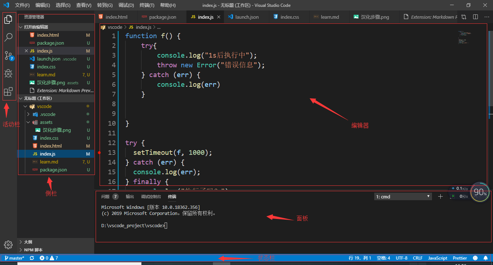
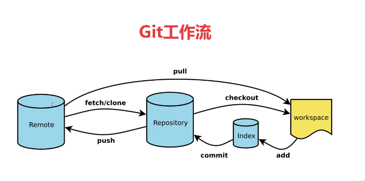

vscode的使用笔记
==========================================
## 1.主要内容
1.用户配置（界面，主题，快捷键配置）
2.Git配置（Git下载、安装、使用）
3.扩展插件的安装和使用

首先为vscode安装汉化插件：在商店中搜索Chinese(Simplified)...,安装第一个即可，然后重启vscode。

## 2.用户配置
### 2.1基本布局
1.活动栏
2.侧栏
3.编辑器
4.面板
5.状态栏

### 2.2颜色主题
#### 2.2.1 打开颜色主题切换命令的方式
1、文件>首选项>颜色主题(ctrl+k ctrl+t)
2、查看>命令面板>输入theme:(ctrl+shift+p打开命令面板)
选中的主题就是当前主题，可以通过点击键盘的上下键进行预览
####2.2.2 下载安装扩展主题
1.打开扩展（商店），搜索theme会有颜色主题，和图标主题，
2.打开颜色主题命令面板，点击安装其他颜色主题

#### 2.2.3禁用某些主题
1.原因：安装某个扩展主题会有一系列的主题，主题列表会很长，那么我们将一些n内置的不用的主题可以禁用，它就不会在出现我们的主题列表里了。
2.步骤：扩展（商店）>...(更多操作)>点击内置的扩展>选择你想要禁用的主题

### 2.3图标主题

#### 2.3.1 打开文件图标主题切换命令的方式
1、文件>首选项>文件图标主题
#### 2.3.2 下载安装扩展图标主题
1.打开扩展（商店），搜索theme会有颜色主题，和图标主题，
2.打开图标主题命令面板，点击安装其他文件图标主题

安装vscode-icons
### 2.4 用户和工作区
#### 2.4.1 区别
1.用户设置-全局应用于您打开的任何vs代码实例的设置(521个设置)
2.工作区设置-存储在工作区内的设置，仅在打开工作区时应用（543个设置）
用户设置和工作区设置大部分是一样的，只不过工作区有一些特殊的，对于纯前端来说，工作区设置很少能用到，比如说全栈工程师既要写前端代码又要写后端代码，前端和后端有一些东西是不一样的，就需要单独去配置，需要去设置工作区。
打开设置：文件>首选项>设置 或者文件>ctrl+,

#### 2.4.2 用户设置
##### 1.常用设置
1.Files: Auto Save 可以设置保存方式
2.Editor: Font Size 设置字体大小
3.Editor: Tab Size 设置一个tab代表几个空格
4.Editor: Multi Cursor Modifier在通过鼠标添加多个光标时使用的修改键。“转到定义”和“打开链接”功能所需的鼠标动作将会相应调整，不与多光标修改键冲突。阅读详细信息。
5.Editor: Word Wrap 一般选择on:在可视范围内换行
##### 2.文本编辑器
1.字体 比如1和l有些字体区分的不明显，就需要我们选择一个合适的字体
2.格式化 如果从别处粘贴来的代码可能是乱的，就需要我们格式化一下代码
3.缩略图 可以快速帮我们定位的代码的位置

##### 3.工作台
1.Command Palette: History控制命令面板中保留最近使用命令的数量。
2.外观：控制工作栏的位置可见性等等
### 2.5快捷键
ctrl+c 不选中时，复制整行
ctrl+x 不选中时，剪切整行
ctrl+f 光标在查找框内，按enter就查找下一个，如果不在按f3查找下一个
ctrl+h 替换，按enter替换，ctrl+alt+enter全部替换
ctrl+s保存
行注释：ctrl+/
块注释：选中>shift+alt+a
ctrl+shift+enter 上方加入一行
ctrl+shift+f 文件夹查找相当于点击活动栏的搜索图标
 
ctrl+enter下方插入一行 从元素的内跳出来
alt+shift+f:格式化代码
#### 2.5.2 快捷键映射
1.把其他编辑器的快捷键应用到vscode上
文件>首选项>按键映射
2.自定义快捷键方式：
文件>首选项>键盘快捷方式
## 3.git配置

git教程请见另一篇 [git使用总结]()
### 3.1vscode使用git
点击活动栏的分支管理器：
1.点击+暂存更改还没有提交
2.点击对勾符号提交，输入提交信息
3.点击...>点击推送
## 4.插件安装
1.css Peek: html和css关联
2.Prettier:代码格式化
3.Icon Fonts :图标集，只是作为一个提示工具，要想用图标还得自己去引入图标集的css
4.Auto Rename Tag:自动修改标签
5.html Boilerplate: HTML模板
6.color Info :颜色提示
7.Auto Close Tag自动闭合
8.HTML CSS Support :html中css class的智能提示
